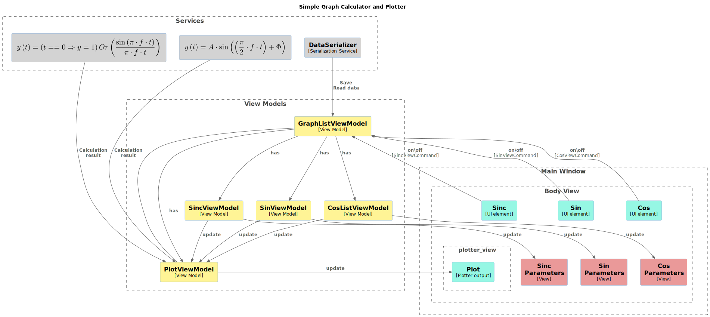

# Simple Graph Calculator and Plotter

The main goal of this application is to allow users to interactively observe the behavior of Sine, Cosine, and Sinc
functions.

It will provide a tool for calculating and 2D visualizing these functions, allowing users to manipulate parameters
and observe the resulting changes in the graphs. 

The results of the observation can be saved in vector format.

## Solution
To achieve this goal, a WPF application named “Simple Graph Calculator and Plotter” must be developed. This
application will be designed using the MVVM pattern and will contain a control panel for functions and
parameters, as well as a plotting area for the graphs.

## Component Diagram
This diagram presents the application's main components and the relationships between them.

## Third-Party library
The third-party library ScottPlot.WPF is an excellent option for application development. The main advantages of
using this library are:
* it's an open-source library with a permissive MIT license, so there are no restrictions on its use in
commercial or personal projects;
* it offers a wide range of tools for visualizing any kind of data, from simple line plots to complex charts;
* it offers functionality to save graphs in vector format;
* the library is designed to be very easy to implement and integrate into your software.
  
References: [ScottPlot.WPF](https://scottplot.net/quickstart/wpf/)
